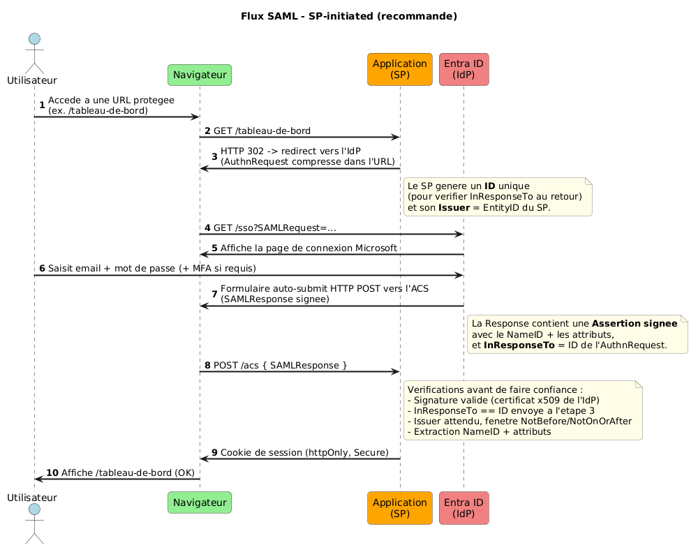
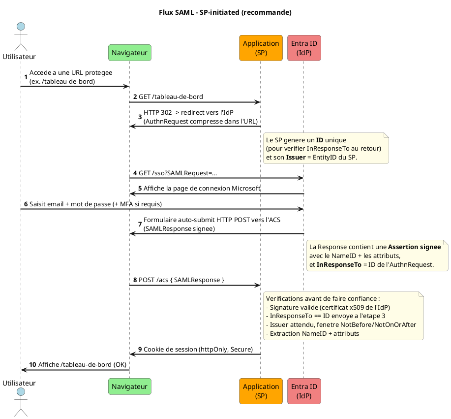
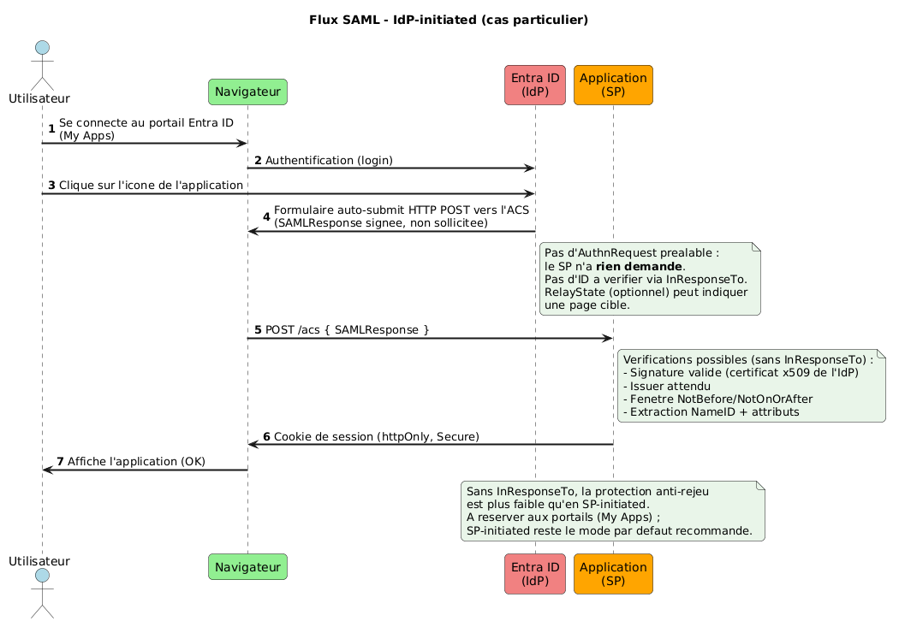
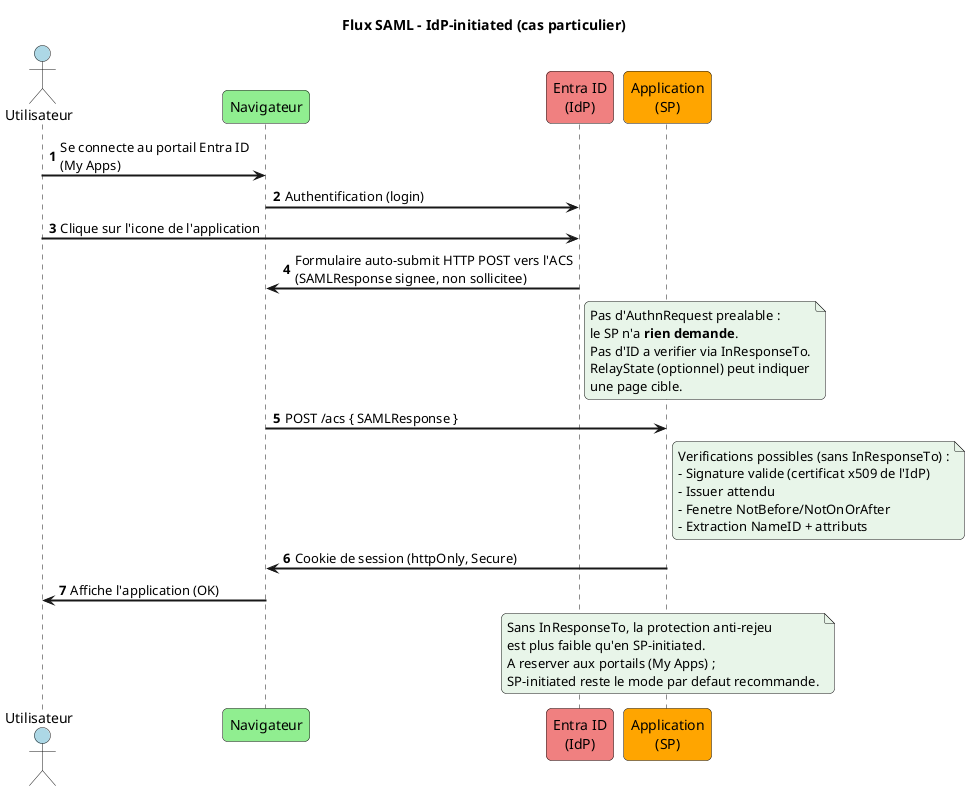
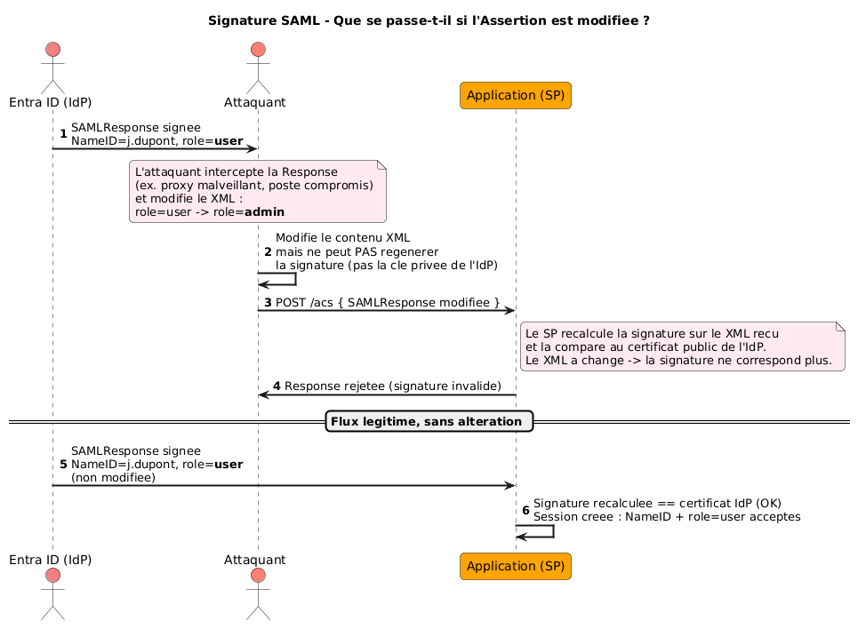
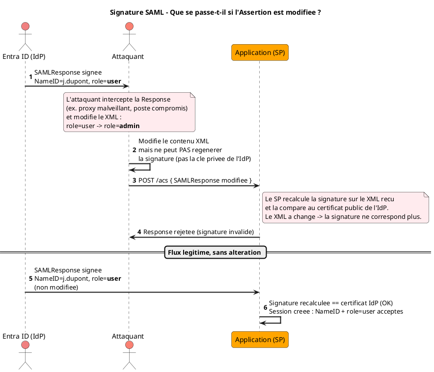
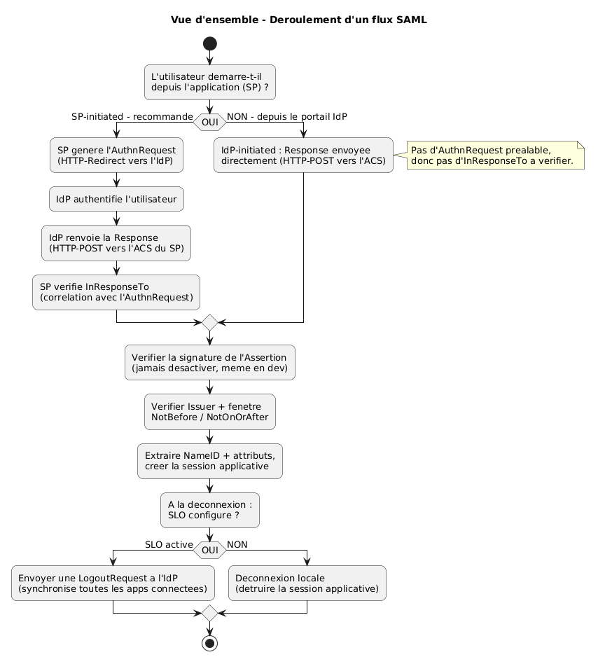
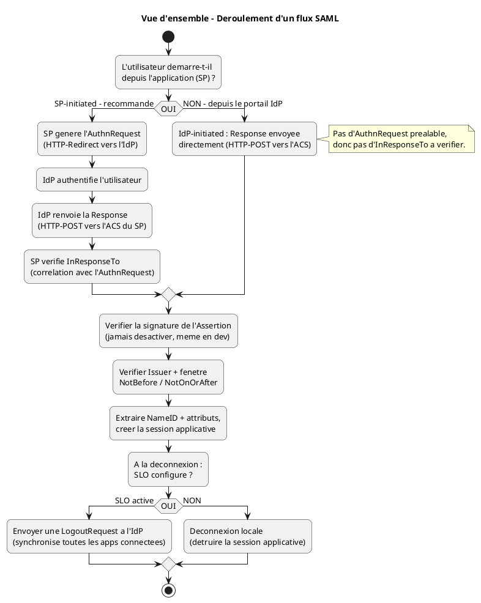

# 3.3 Comprendre le flux SAML — Guide visuel

Ce document vulgarise le fonctionnement de l'authentification SAML avec Entra ID : les deux façons de déclencher le flux (**SP-initiated** et **IdP-initiated**), le rôle central de la **signature XML**, et la différence entre **SLO** et déconnexion locale.

## Images — Git (Markdown) vs Confluence

Les 4 schémas ont le **même nom de fichier** dans les deux mondes, mais **pas le même chemin** :

| Rendu | Où vit le fichier | Syntaxe |
| --- | --- | --- |
| **Markdown** (ce dépôt) | `docs/images/3.3/` (versionné dans Git) | `` — chemin **relatif** à ce fichier `.md` |
| **Confluence** | pièce jointe **de la page** (pas de dossier) | `!<fichier>.png\|width=…!` — le nom seul, jamais `images/3.3/` |

| Schéma | Fichier Git | Wiki Confluence |
| --- | --- | --- |
| Flux SP-initiated | [`images/3.3/3.3-01-flux-sp-initiated.png`](images/3.3/3.3-01-flux-sp-initiated.png) | `!3.3-01-flux-sp-initiated.png\|width=900!` |
| Flux IdP-initiated | [`images/3.3/3.3-02-flux-idp-initiated.png`](images/3.3/3.3-02-flux-idp-initiated.png) | `!3.3-02-flux-idp-initiated.png\|width=900!` |
| Démo attaque signature | [`images/3.3/3.3-03-demo-attaque-signature.png`](images/3.3/3.3-03-demo-attaque-signature.png) | `!3.3-03-demo-attaque-signature.png\|width=850!` |
| Arbre de décision | [`images/3.3/3.3-04-arbre-decision.png`](images/3.3/3.3-04-arbre-decision.png) | `!3.3-04-arbre-decision.png\|width=800!` |

Le source PlantUML de chaque schéma est replié sous l'image (`
`), équivalent du macro `{expand}` Confluence. Pour republier dans Confluence : attacher les PNG **à la page** (pas dans un espace fichiers), en conservant le nom `3.3-0N-….png`.

---

## 1. Avant tout : comprendre les acteurs et le vocabulaire

Dans un flux SAML, il y a toujours trois acteurs :

| Acteur | Rôle | Dans notre contexte |
| --- | --- | --- |
| **L'utilisateur** | Veut accéder à une ressource protégée | Un agent qui se connecte à une application interne |
| **Le SP (Service Provider)** | Consomme l'authentification, sans la réaliser lui-même | Votre application |
| **L'IdP (Identity Provider)** | Authentifie l'utilisateur et émet l'Assertion | Microsoft Entra ID — le nouveau SSO cible |

**L'analogie de la lettre officielle scellée :**
Une **Assertion** SAML, c'est comme une lettre officielle : elle contient une identité (le **NameID**) et des informations complémentaires (les **attributs**, ex. rôle, service). Cette lettre est glissée dans une enveloppe fermée par un **cachet de cire** (la signature XML). Le SP ne fait confiance au contenu de la lettre que si le cachet est intact et correspond bien à celui de l'IdP — jamais autrement.

> Les définitions générales (IdP, SP, Assertion, ACS, SLO...) sont dans **0. Migration SSO Eagles — Vue d'ensemble**, section **1.2 Protocoles SAML** (Notions à connaître). Le détail des attributs (Legacy vers Entra ID) est dans **1.3 Guide migration SAML - Gestion privée**, section **Attributs (Legacy vers IdP)**, et dans **3.4 Checklist de demande IAM - Raccordement SAML**.

---

## 2. Le flux SP-initiated (recommandé)

### 2.1 Caractéristiques

C'est le mode **par défaut** : l'utilisateur commence son parcours **sur votre application**. Le SP initie la demande d'authentification en envoyant une **AuthnRequest** à l'IdP. Ce mode est recommandé car il permet une vérification supplémentaire au retour (voir section 2.3).

### 2.2 Schéma du flux SP-initiated

**Flux SAML — SP-initiated (recommandé)**

*Fichier Git : `images/3.3/3.3-01-flux-sp-initiated.png` — attachement Confluence (même nom, sans dossier) : `!3.3-01-flux-sp-initiated.png|width=900!`*

Voir le code source PlantUML (pour modification future)

### 2.3 Ce qu'il faut retenir

- **L'AuthnRequest** part en **HTTP-Redirect** (petite taille, tient dans une URL) ; la **Response** revient en **HTTP-POST** (contenu plus volumineux : Assertion signée complète).

- **InResponseTo** est la protection spécifique au mode SP-initiated : le SP vérifie que la Response reçue correspond bien à une AuthnRequest qu'il a lui-même envoyée, et pas à une Response rejouée ou non sollicitée.

- **La signature** est vérifiée avant toute autre chose (détail section 4).

- **NameID et attributs** : voir **1.3 Guide migration SAML - Gestion privée**, section **Attributs (Legacy vers IdP)**, pour le détail du mapping applicatif.

---

## 3. Le flux IdP-initiated (cas particulier)

### 3.1 Caractéristiques

Dans ce mode, l'utilisateur commence son parcours **sur le portail Entra ID** (My Apps), pas sur l'application. Il clique sur l'icône de l'application et l'IdP envoie directement une Response au SP, **sans qu'aucune AuthnRequest n'ait été émise**.

### 3.2 Schéma du flux IdP-initiated

**Flux SAML — IdP-initiated (cas particulier)**

*Fichier Git : `images/3.3/3.3-02-flux-idp-initiated.png` — attachement Confluence (même nom, sans dossier) : `!3.3-02-flux-idp-initiated.png|width=900!`*

Voir le code source PlantUML (pour modification future)

### 3.3 Ce qu'il faut retenir

- Il n'y a **pas d'AuthnRequest** : la Response arrive directement, sans que le SP l'ait sollicitée.

- Le SP **ne peut pas vérifier InResponseTo** (puisqu'il n'y a pas eu de demande à corréler) — il reste donc plus vulnérable à la relecture ou au rejeu qu'en SP-initiated.

- Ce mode s'utilise typiquement quand l'utilisateur passe par un portail d'applications (My Apps) plutôt que par l'URL directe de l'application.

- Par défaut, **privilégiez toujours le mode SP-initiated** (section 2) sauf besoin explicite du portail.

---

## 4. Pourquoi la signature protège l'Assertion (et pourquoi on ne la désactive jamais)

La signature XML est ce qui fait le lien entre le contenu de l'Assertion (NameID, attributs) et la garantie qu'elle vient bien d'Entra ID, sans avoir été modifiée en chemin. Le schéma ci-dessous illustre ce qui se passe si un attaquant tente de modifier une Assertion interceptée.

**Pourquoi la signature XML protège l'Assertion**

*Fichier Git : `images/3.3/3.3-03-demo-attaque-signature.png` — attachement Confluence (même nom, sans dossier) : `!3.3-03-demo-attaque-signature.png|width=850!`*

Voir le code source PlantUML (pour modification future)

> [!WARNING]
> **Ce qu'il faut retenir :** l'attaquant peut intercepter et modifier le XML, mais il ne possède pas la clé privée de l'IdP — il ne peut donc pas régénérer une signature valide pour son contenu modifié. C'est pour cette raison que la vérification de signature **ne doit jamais être désactivée**, même temporairement en développement : c'est elle, et elle seule, qui garantit que ce que vous lisez (NameID, rôle, service...) vient réellement d'Entra ID.

---

## 5. Bindings : HTTP-Redirect vs HTTP-POST — pourquoi ce choix ?

| Message | Binding utilisé | Pourquoi |
| --- | --- | --- |
| `AuthnRequest` (SP vers IdP) | **HTTP-Redirect** | Message court, compressé : tient dans une URL |
| Response (IdP vers SP) | **HTTP-POST** | Message volumineux (Assertion signée complète) : ne tiendrait pas dans une URL |
| `LogoutRequest` / `LogoutResponse` (SLO) | **HTTP-Redirect** (le plus courant) | Message court, comme l'`AuthnRequest` |

Un écart par rapport à ce standard (ex. Response en Redirect) doit être documenté : voir **3.4 Checklist de demande IAM - Raccordement SAML**, section **Bindings SAML**.

---

## 6. SP-initiated vs IdP-initiated — Comparaison côte à côte

| Critère | **SP-initiated** | **IdP-initiated** |
| --- | --- | --- |
| **Où commence l'utilisateur ?** | Sur l'application (SP) | Sur le portail Entra ID (My Apps) |
| **`AuthnRequest` émise ?** | Oui | Non |
| **Vérification `InResponseTo` possible ?** | Oui | Non |
| **Protection anti-rejeu** | Plus forte (`InResponseTo`) | Plus faible |
| **Usage recommandé** | Mode par défaut | Portails d'applications uniquement |
| **Signature de la Response vérifiée ?** | Oui, toujours | Oui, toujours |

---

## 7. Les questions que tout le monde se pose

**"Pourquoi l'AuthnRequest part en Redirect alors que la Response part en POST ?"**
Uniquement une question de taille : l'AuthnRequest est un message court qui tient dans une URL compressée, tandis que la Response contient l'Assertion signée complète (NameID, attributs, signature XML), bien trop volumineuse pour une URL.

**"Que se passe-t-il si on désactive la vérification de signature en développement, juste pour tester plus vite ?"**
N'importe qui pourrait alors forger une Assertion avec l'identité ou le rôle de son choix, sans jamais passer par Entra ID. C'est pourquoi cette vérification ne doit **jamais** être désactivée, même en développement (voir section 4).

**"Pourquoi privilégier SP-initiated si IdP-initiated fonctionne aussi ?"**
Parce que SP-initiated permet de vérifier **InResponseTo**, une protection supplémentaire contre le rejeu qu'IdP-initiated ne permet pas (l'IdP-initiated n'a pas de demande préalable à laquelle se référer).

**"Le SLO échoue pour une des applications connectées, que se passe-t-il pour les autres ?"**
Cela dépend de l'implémentation de chaque SP, mais en général les autres sessions ne sont pas automatiquement invalidées : c'est pourquoi il faut prévoir un mécanisme de déconnexion locale de secours (voir section 8), même quand le SLO est activé.

**"NameID et attributs, c'est la même chose ?"**
Non. Le **NameID** est l'identifiant unique de l'utilisateur (l'équivalent d'une clé primaire). Les **attributs** sont des informations complémentaires (rôle, service, email...). Le détail est dans **1.3 Guide migration SAML - Gestion privée**, section **Attributs (Legacy vers IdP)**.

---

## 8. Récapitulatif visuel — Vue d'ensemble

**Vue d'ensemble — déroulement d'un flux SAML**

*Fichier Git : `images/3.3/3.3-04-arbre-decision.png` — attachement Confluence (même nom, sans dossier) : `!3.3-04-arbre-decision.png|width=800!`*

Voir le code source PlantUML (pour modification future)

---

## Références

- [Single sign-on SAML protocol (Microsoft Entra ID)](https://learn.microsoft.com/en-us/entra/identity-platform/single-sign-on-saml-protocol)
- [Certificate signing options in a SAML token (Microsoft)](https://learn.microsoft.com/en-us/entra/identity/enterprise-apps/certificate-signing-options)
- [SAML 2.0 Core (Assertions and Protocols), OASIS](https://docs.oasis-open.org/security/saml/v2.0/saml-core-2.0-os.pdf)
- [SAML 2.0 Bindings, OASIS](https://docs.oasis-open.org/security/saml/v2.0/saml-bindings-2.0-os.pdf)
- **Dans ce projet** : **1.3 Guide migration SAML - Gestion privée**, sections 3 (prérequis) et 4.1 à 4.7 (flux détaillé).
